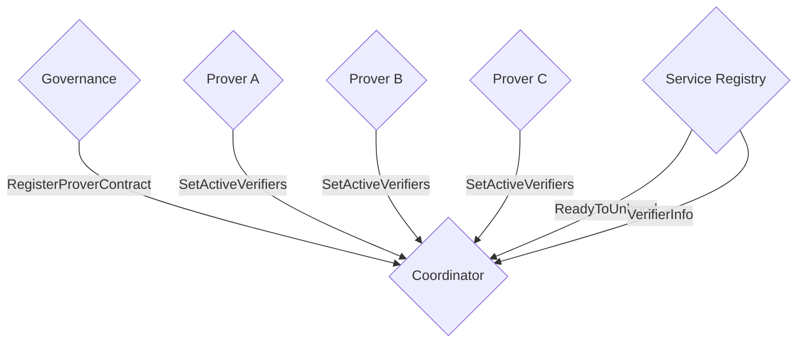

# Coordinator

Some contracts, like the multisig provers, are deployed per chain and unknown to one another. The coordinator contract
keeps track of these chain-dependent provers and coordinates any interaction that requires knowledge of all of them.
For example, the ability for a verifier to unbond their stake requires checking that it is not part of any active
verifier set on any chain. Provers also push their currently active verifier set to the coordinator whenever it
changes, so the coordinator can answer those cross-chain questions.

## Interface

```Rust
pub struct InstantiateMsg {
    /// Governance address. Calls all governance-permissioned messages such as RegisterProverContract.
    pub governance_address: String,
    /// Service registry contract address on axelar. Used by VerifierInfo queries to resolve registration data.
    pub service_registry: String,
}

pub enum ExecuteMsg {
    // Registers a multisig prover address against a chain name. Used as part of the registry
    // the coordinator maintains for cross-chain bookkeeping. Permission: Governance.
    RegisterProverContract {
        chain_name: ChainName,
        new_prover_addr: String,
    },

    // Replaces the active verifier set the coordinator tracks for the calling prover.
    // Provers should call this whenever their active set changes so the coordinator can
    // answer ReadyToUnbond and VerifierInfo queries consistently across chains.
    // Permission: Specific(prover) — only the prover registered for some chain can call.
    SetActiveVerifiers { verifiers: HashSet<String> },
}

pub enum QueryMsg {
    // Returns true if the verifier is not part of any active verifier set tracked by the
    // coordinator. Used by the service registry as the unbonding gate.
    ReadyToUnbond { verifier_address: String },

    // Returns the verifier's registration entry, total weight, supported chains, and the
    // set of chains the verifier is currently signing for.
    VerifierInfo {
        service_name: String,
        verifier: String,
    },
}

pub struct VerifierInfo {
    pub verifier: Verifier,
    pub weight: nonempty::Uint128,
    pub supported_chains: Vec<ChainName>,
    pub actively_signing_for: HashSet<Addr>,
}
```

## Coordinator graph


