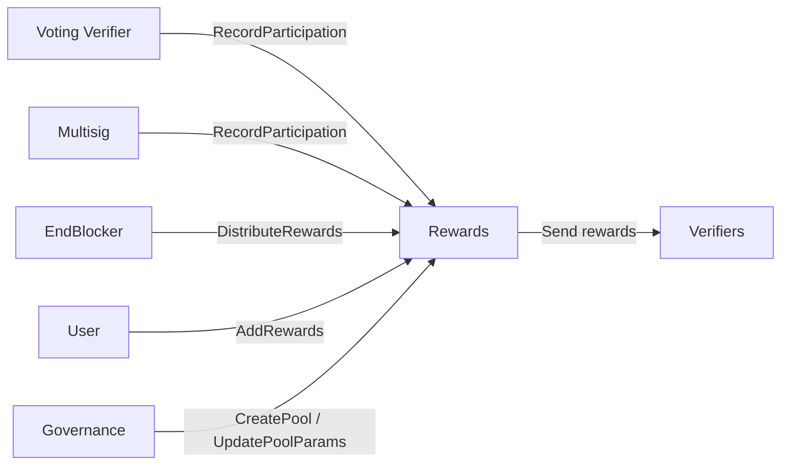
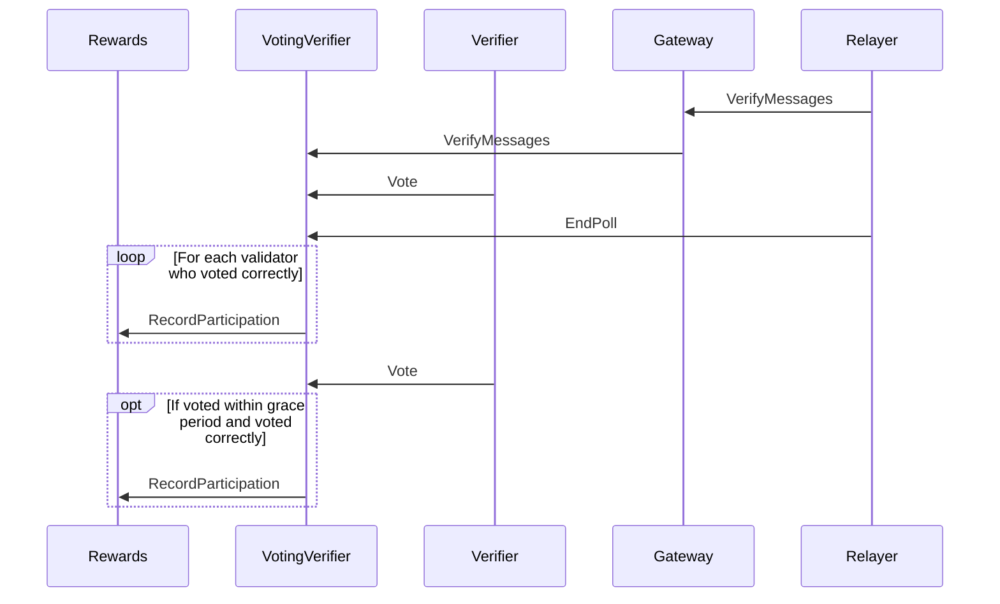
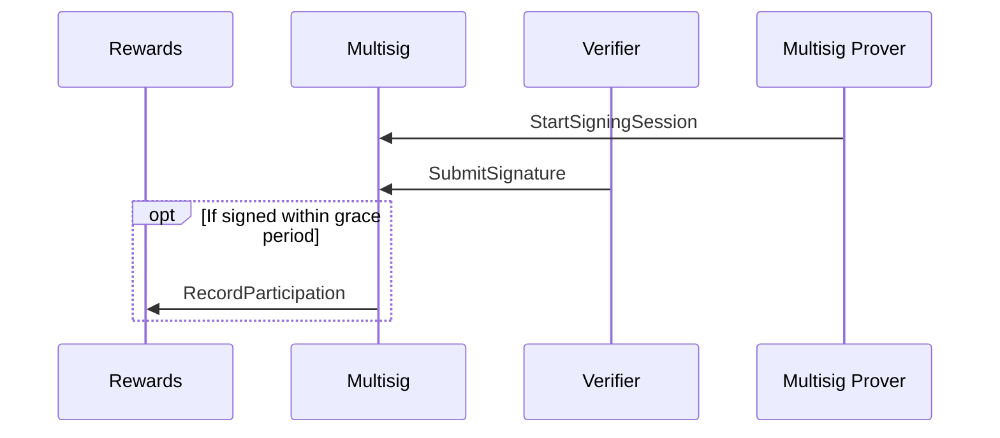

# Rewards



The rewards contract is responsible for tracking verifier participation in voting and signing. The voting verifier and
multisig contracts send messages to the rewards contract when verifiers participate in events. The rewards contract
keeps a tally of how many events each verifier participated in. Participation is assessed per epoch, which is a length
of time configurable by governance.

Calling `DistributeRewards` distributes rewards for up to a configurable number of historical epochs ending at epoch
T-2 (so if we are in epoch 10, undistributed rewards for epochs 0 to 8 are paid out). Rewards are split equally amongst
all participating verifiers in each epoch. The rewards rate (number of tokens distributed per epoch) is configurable
by governance via `UpdatePoolParams`. Pools themselves are created via `CreatePool` (also governance-gated).

Anyone can add funds to a rewards pool by calling `AddRewards`. Anyone can call `DistributeRewards` and trigger
rewards distribution, but it is designed to be called automatically by the end blocker.

Verifiers can route their rewards to a proxy address via `SetVerifierProxy` and later remove that mapping via
`RemoveVerifierProxy`.

## Interface

```Rust
pub enum ExecuteMsg {
    // Log a specific verifier as participating in a specific event. Permission: Any.
    // Errors if the pool does not yet exist.
    RecordParticipation {
        chain_name: ChainName,
        event_id: nonempty::String,
        verifier_address: String,
    },

    // Distribute rewards up to epoch T-2 and send the required tokens to each verifier.
    // Permission: Any. Errors if the pool does not yet exist.
    DistributeRewards {
        pool_id: PoolId,
        // Maximum number of historical epochs to process. Defaults to 10.
        epoch_count: Option<u64>,
    },

    // Adds attached funds to the named pool. Funds whose denom does not match the rewards
    // denom are ignored. Permission: Any. Errors if the pool does not yet exist.
    AddRewards { pool_id: PoolId },

    // Overwrites the params for the specified pool. Permission: Governance.
    // Errors if the pool does not yet exist.
    UpdatePoolParams { params: Params, pool_id: PoolId },

    // Creates a rewards pool with the specified pool id and parameters. Permission: Governance.
    CreatePool { params: Params, pool_id: PoolId },

    // Future rewards for the sender are paid out to the proxy address instead. Permission: Any.
    SetVerifierProxy { proxy_address: Address },

    // Removes any proxy address associated with the sender. Permission: Any.
    RemoveVerifierProxy {},
}

pub enum QueryMsg {
    // Returns balance, epoch parameters, and last-distribution epoch for a pool.
    RewardsPool { pool_id: PoolId },

    // Returns the participation record for the given epoch (or current if unspecified).
    VerifierParticipation {
        pool_id: PoolId,
        epoch_num: Option<u64>,
    },

    // Returns the proxy address associated with the given verifier, if any.
    VerifierProxy { verifier: Address },
}

pub struct Params {
    // Length of an epoch in blocks. Participation is measured over windows of this size.
    pub epoch_duration: nonempty::Uint64,
    // Tokens distributed per epoch, split equally amongst participating verifiers.
    pub rewards_per_epoch: nonempty::Uint128,
    // Fraction of events in an epoch a verifier must participate in to receive rewards.
    pub participation_threshold: Threshold,
}
```

## Voting Flow



## Signing Flow


