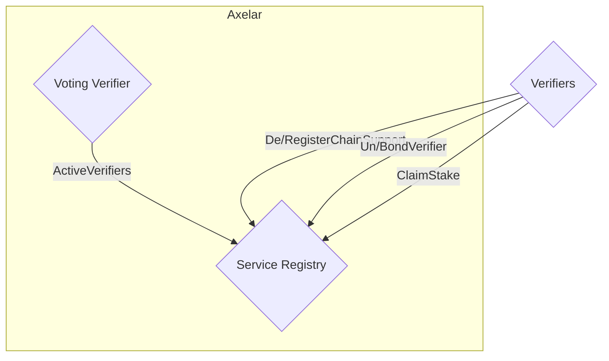
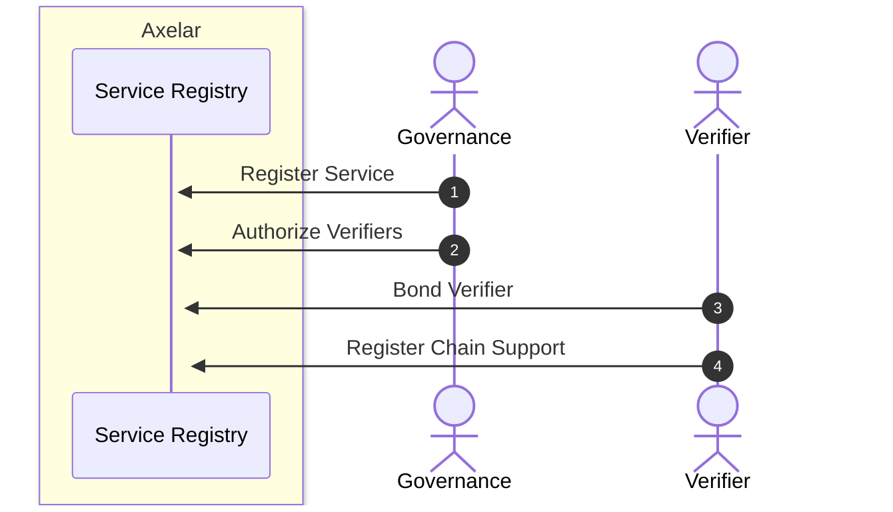

# Service Registry

The service registry keeps track of the pool of verifiers that vote and sign for each chain. The core functionalities,
such as registering a new service, verifier authorization and un-authorization, can only be called from a governance
address. Verifier bonding and unbonding, as well as registering support for specific chains, are called by the verifier
themselves. The service registry is used by ampd, the voting verifier, and the multisig prover.

The term `service` refers to an upper-level entity that includes several `chains`. The difference is in how they are
related to each other, which is hierarchical: a service is like an umbrella that regulates the activities of several
chains that fall under its purview. The service defines common parameters, such as verifier requirements, bonding
details, and unbonding periods, which are applicable to all associated chains. Thus, a single instance of service
registry is used to organize and coordinate activities across all chains.

## Interface

```Rust
pub enum ExecuteMsg {
    // Can only be called by governance account.
    RegisterService {
        service_name: String,
        coordinator_contract: String,
        min_num_verifiers: u16,
        max_num_verifiers: Option<u16>,
        min_verifier_bond: nonempty::Uint128,
        bond_denom: String,
        unbonding_period_days: u16,
        description: String,
    },

    // Updates modifiable fields of the service. Permission: Governance.
    UpdateService {
        service_name: String,
        updated_service_params: UpdatedServiceParams,
    },

    // Authorizes verifiers to join a service. Verifiers must still bond sufficient stake
    // to participate. Permission: Governance.
    AuthorizeVerifiers {
        verifiers: Vec<String>,
        service_name: String,
    },

    // Revoke authorization for specified verifiers. Verifiers bond remains unchanged.
    // Permission: Governance.
    UnauthorizeVerifiers {
        verifiers: Vec<String>,
        service_name: String,
    },

    // Jail verifiers. Jailed verifiers are not allowed to unbond or claim stake.
    // Permission: Governance.
    JailVerifiers {
        verifiers: Vec<String>,
        service_name: String,
    },

    // Register support for the specified chains. Permission: Specific(verifier).
    RegisterChainSupport {
        service_name: String,
        chains: Vec<ChainName>,
    },

    // Deregister support for the specified chains. Permission: Specific(verifier).
    DeregisterChainSupport {
        service_name: String,
        chains: Vec<ChainName>,
    },

    // Locks up any funds sent with the message as stake. Marks the sender as a potential
    // verifier that can be authorized. Permission: Any.
    BondVerifier { service_name: String },

    // Initiates unbonding of staked funds for the sender. Permission: Any.
    UnbondVerifier { service_name: String },

    // Claim previously staked funds that have finished unbonding for the sender. Permission: Any.
    ClaimStake { service_name: String },
}

pub enum QueryMsg {
    // Returns the weighted active verifier list for the given service and chain.
    ActiveVerifiers {
        service_name: String,
        chain_name: ChainName,
    },

    // Returns the Service config for the given service name.
    Service { service_name: String },

    // Returns details (registration, weight, supported chains) for a specific verifier.
    Verifier {
        service_name: String,
        verifier: String,
    },
}

// Fields that can be patched via UpdateService. Any None field leaves the existing value
// unchanged.
pub struct UpdatedServiceParams {
    pub min_num_verifiers: Option<u16>,
    pub max_num_verifiers: Option<Option<u16>>,
    pub min_verifier_bond: Option<nonempty::Uint128>,
    pub unbonding_period_days: Option<u16>,
}
```

## Service Registry graph



## Service Registry sequence diagram



1. Governance registers a new service by providing the necessary parameters for the service. It can later modify these
   parameters via `UpdateService`.
2. Governance authorizes verifiers to join the service by sending an `AuthorizeVerifiers` message.
3. Verifiers bond to the service, providing stake, by sending a `BondVerifier` message with appropriate funds included.
   Note that authorizing and bonding can be done in any order.
4. Verifiers register support for specific chains within the service by specifying service name and chain names.

### Notes

1. For the process of signing, verifiers need to register their public key in advance to be able to participate; the
   details of which are available in the [multisig documentation](multisig.md).
