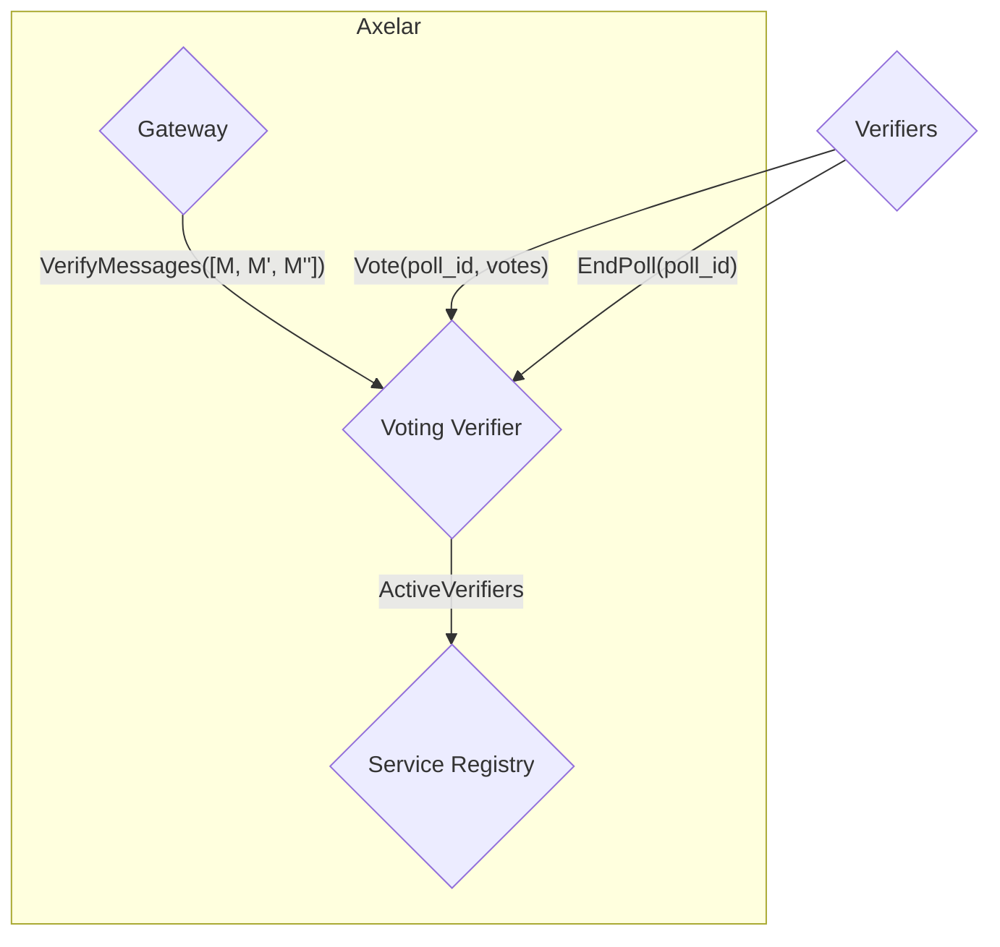
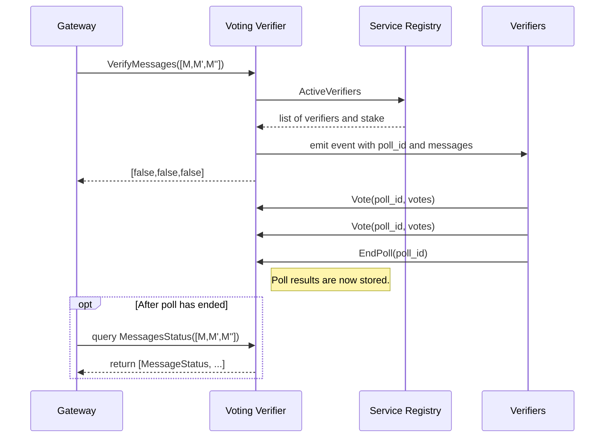

# Voting Verifier

The voting verifier verifies batches of messages via RPC voting. Polls are created and votes are cast via a generic
voting module, which the voting verifier uses. The generic voting module does not know the meaning of the polls, and
simply returns a Poll ID to the voting verifier. The voting verifier internally maps a Poll ID to the messages in the
poll, storing the results in storage. The gateway can then query the voting verifier to check message verification
status.

There are two types of polls: messages polls and verifier set polls. Messages polls are used to verify incoming
messages, while verifier set polls are used to verify that the external gateway has updated its stored verifier set.
Verifier set polls are a necessary component of the verifier set update flow. See [`update and confirm VerifierSet
sequence diagram`](multisig_prover.md) for more details.

## Interface

```Rust
pub enum ExecuteMsg {
    // Computes the results of a poll. For all verified messages, marks them as verified
    // in storage so the gateway can later query their status. Permission: Any.
    EndPoll { poll_id: PollId },

    // Casts votes for the specified poll. Permission: Any (only active verifiers count
    // toward quorum).
    Vote { poll_id: PollId, votes: Vec<Vote> },

    // Returns a vector indicating current verification status for each message; starts a
    // poll for any not yet verified messages. Permission: Any.
    VerifyMessages(Vec<Message>),

    // Starts a poll to confirm a verifier set update on the external gateway. Permission: Any.
    VerifyVerifierSet {
        message_id: nonempty::String,
        new_verifier_set: VerifierSet,
    },

    // Update the threshold used for new polls. Permission: Governance.
    UpdateVotingThreshold {
        new_voting_threshold: MajorityThreshold,
    },
}

pub enum QueryMsg {
    // Returns a PollResponse for the given poll id.
    Poll { poll_id: PollId },

    // Returns the verification status of each message in the input.
    MessagesStatus(Vec<Message>),

    // Returns the verification status of the given verifier set.
    VerifierSetStatus(VerifierSet),

    // Returns the currently configured voting threshold.
    CurrentThreshold,
}
```

## Verifier graph



## Message Verification Sequence Diagram


