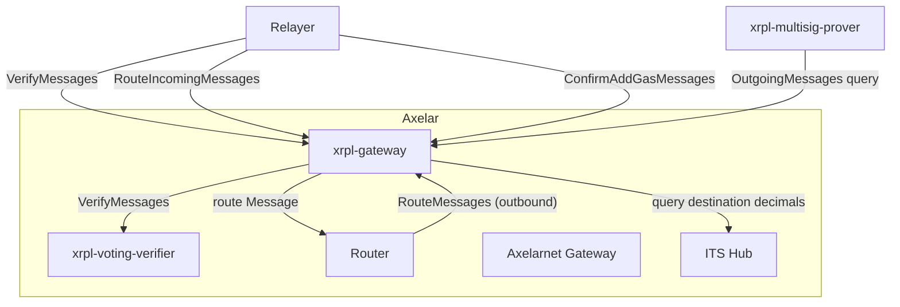

# XRPL Gateway

Source: [`contracts/xrpl-gateway`](https://github.com/axelarnetwork/axelar-amplifier-xrpl/tree/main/contracts/xrpl-gateway).

The XRPL Gateway is the Axelar-side entry and exit point for all XRPL traffic. On other Amplifier chains a thin "gateway" contract simply moves verified messages between a voting verifier and the router; on XRPL the gateway is **fat** and also absorbs the [ITS edge](../glossary.md#its-edge) role, the token-id registry, and the gas accounting that on other chains lives in separate contracts. This is because XRPL has no smart contracts at all: every responsibility that would normally be on the external chain has to land somewhere on Axelar, and the gateway is the natural home for it.

## What XRPL-specific work this contract absorbs compared to the generic gateway

| Concern | Generic [`gateway`](gateway.md) | XRPL Gateway |
| --- | --- | --- |
| Verifying incoming messages with the voting verifier | Yes | Yes |
| Storing outgoing messages for the prover | Yes | Yes |
| Routing verified inbound to the router | Yes | Yes (`RouteIncomingMessages`) |
| Acting as ITS edge (translating to ITS Hub messages) | No (separate ITS edge contract on the chain) | **Yes**: holds the token-id registry, computes `SEND_TO_HUB` wrappers, queries Hub for destination decimals, scales amounts |
| Token registration / linking / metadata pushing | No | **Yes**: `RegisterLocalToken`, `RegisterRemoteToken`, `RegisterTokenMetadata`, `LinkToken`, `DeployRemoteToken` |
| Gas accounting for inbound messages | No | **Yes**: tracks accrued gas per token id; `ConfirmAddGasMessages` |

## Interface

```Rust
pub struct InstantiateMsg {
    pub admin_address: String,
    pub governance_address: String,
    pub verifier_address: String,        // the xrpl-voting-verifier
    pub router_address: String,
    pub its_hub_address: String,         // ITS Hub contract on Axelar
    pub its_hub_chain_name: ChainName,
    pub chain_name: ChainName,           // "xrpl"
    pub xrpl_multisig_address: XRPLAccountId, // the on-XRPL gateway account
}

pub enum ExecuteMsg {
    // ITS-edge token registration. Operations gated to admin/governance.

    // Register XRPL token metadata for use in custom token linking. Permission: Elevated.
    RegisterTokenMetadata { xrpl_token: XRPLTokenOrXrp },

    // Register an XRPL-native token (issuer != multisig) as an interchain token.
    // Derives tokenId = linked_token_id(chain_hash, issuer, currency_hash). Permission: Elevated.
    RegisterLocalToken { xrpl_token: XRPLToken },

    // Register a remote-origin token: maps an XRPL currency code to a token id whose XRPL
    // representation is an IOU issued by the multisig itself. Permission: Elevated.
    RegisterRemoteToken {
        token_id: TokenId,
        xrpl_currency: XRPLCurrency,
    },

    // Send a HubMessage::SendToHub(LinkToken) to the ITS Hub. Permission: Elevated.
    LinkToken {
        token_id: TokenId,
        destination_chain: ChainNameRaw,
        link_token: LinkToken,
    },

    // Send a HubMessage::SendToHub(DeployInterchainToken) to the ITS Hub. Permission: Elevated.
    DeployRemoteToken {
        xrpl_token: XRPLTokenOrXrp,
        destination_chain: ChainNameRaw,
        token_metadata: TokenMetadata,
    },

    // GMP machinery (called by relayers).

    // Trigger verification at the voting verifier for any of the given XRPL messages that
    // is still unverified. Permission: Any.
    VerifyMessages(Vec<XRPLMessage>),

    // Store outgoing messages received from the router (delivered to XRPL by the prover).
    // Misnamed for router compatibility: this is "RouteOutgoingMessages" semantically.
    // Permission: Specific(router).
    RouteMessages(Vec<Message>),

    // Route already-verified inbound messages on to the ITS Hub or to the destination
    // chain (for pure GMP), depending on the XRPLMessage variant. Permission: Any.
    RouteIncomingMessages(Vec<WithPayload<XRPLMessage>>),

    // Credit a verified XRPLAddGasMessage to the accrued gas pool for its token id.
    // Permission: Any.
    ConfirmAddGasMessages(Vec<XRPLAddGasMessage>),

    // Admin / killswitch.
    UpdateAdmin { new_admin_address: String },           // Elevated
    EnableExecution,                                     // Elevated
    DisableExecution,                                    // Elevated
}

pub enum QueryMsg {
    // Messages stored for delivery to XRPL (consumed by the multisig prover).
    OutgoingMessages(Vec<CrossChainId>),

    // Token-id registry lookups.
    XrplToken(TokenId),           // tokenId -> XRPLToken
    XrplTokenId(XRPLToken),       // XRPLToken -> tokenId
    XrpTokenId,                   // tokenId for native XRP
    LinkedTokenId(XRPLToken),     // derive linked tokenId without persisting

    // Per-chain decimals for a token, as registered with the ITS Hub.
    TokenInstanceDecimals { chain_name: ChainNameRaw, token_id: TokenId },

    // Translate an inbound XRPL message to the canonical ITS or GMP form (used by the
    // relayer to preview a RouteIncomingMessages payload).
    InterchainTransfer {
        message: XRPLInterchainTransferMessage,
        payload: Option<nonempty::HexBinary>,
    },
    CallContract {
        message: XRPLCallContractMessage,
        payload: nonempty::HexBinary,
    },

    IsEnabled,
}
```

## The five XRPL message variants

The gateway accepts a single enum [`XRPLMessage`](../glossary.md#interchaintransfermessage) (defined in upstream `packages/xrpl-types`):

| Variant | Direction | Purpose |
| --- | --- | --- |
| `InterchainTransferMessage` | Inbound user payment | Token transfer through ITS to another chain (or to an executable on the destination if `payload` is set). |
| `CallContractMessage` | Inbound user payment | Pure GMP call (no token transfer). Skips the ITS Hub entirely. |
| `AddGasMessage` | Inbound user top-up | Adds gas to an in-flight cross-chain message identified by its original tx hash. |
| `AddReservesMessage` | Inbound operator top-up | XRP-only payment to top up the multi sign account's XRPL reserves. Confirmed by the multisig prover, not the gateway. |
| `ProverMessage` | Outbound from the multisig | Reports that a prover-built XRPL transaction has landed on the ledger. Confirmed by the multisig prover. |

The gateway is the verification entry point for **all five** variants (via `VerifyMessages`), but only handles `InterchainTransferMessage`, `CallContractMessage`, and `AddGasMessage` in its routing/confirmation logic. `AddReservesMessage` and `ProverMessage` are confirmed by the [XRPL Multisig Prover](xrpl_multisig_prover.md).

## XRPL Gateway graph



## Routing graph: inbound XRPL message

```mermaid
sequenceDiagram
autonumber
participant Relayer
box LightYellow Axelar
participant XGW as xrpl-gateway
participant XVV as xrpl-voting-verifier
participant Hub as ITS Hub
participant Router
end

Relayer->>+XGW: ExecuteMsg::VerifyMessages
XGW->>+XVV: ExecuteMsg::VerifyMessages
XVV-->>-XGW: per-message status
XGW-->>-Relayer: response
Note over XVV: poll runs; quorum reached
Relayer->>+XGW: ExecuteMsg::RouteIncomingMessages
alt InterchainTransferMessage
    XGW->>+Hub: query destination decimals
    Hub-->>-XGW: decimals
    XGW->>XGW: scale amount, wrap as SEND_TO_HUB
    XGW->>+Router: RouteMessages (Hub-routed)
else CallContractMessage
    XGW->>XGW: build plain Message (no Hub wrap)
    XGW->>+Router: RouteMessages (direct GMP)
else AddGasMessage
    XGW->>XGW: credit GAS_ACCRUED[token_id]
end
```

1. The relayer submits an `XRPLMessage` for verification.
2. The gateway forwards to the [XRPL Voting Verifier](xrpl_voting_verifier.md), which opens a poll.
3. After quorum is reached the relayer calls `RouteIncomingMessages`.
4. For `InterchainTransferMessage`, the gateway acts as the ITS edge: looks up the token id, queries the ITS Hub for destination decimals, scales the amount, wraps the inner ITS message as `HubMessage::SendToHub(InterchainTransfer)`, and hands it to the router.
5. For `CallContractMessage`, the gateway builds a plain `router_api::Message` with no Hub wrapping. The router delivers it straight to the destination chain's gateway as a pure GMP call.
6. For `AddGasMessage`, the gateway credits the verified top-up amount to `GAS_ACCRUED[token_id]`; no router involvement.

## Routing graph: outbound to XRPL

```mermaid
sequenceDiagram
autonumber
participant Router
box LightYellow Axelar
participant XGW as xrpl-gateway
participant XMP as xrpl-multisig-prover
end

Router->>+XGW: ExecuteMsg::RouteMessages (RECEIVE_FROM_HUB or plain)
XGW->>XGW: store in OUTGOING_MESSAGES
XMP->>+XGW: QueryMsg::OutgoingMessages(cc_ids)
XGW-->>-XMP: stored Messages
```

Messages arriving from the router via `RouteMessages` are not re-verified (the router is trusted) and are stored in the `OUTGOING_MESSAGES` map keyed by `cc_id`. The XRPL Multisig Prover later reads them via the `OutgoingMessages` query when constructing an outbound XRPL Payment.

## State of interest

* `OUTGOING_MESSAGES: Map<&CrossChainId, Message>` — messages queued for outbound XRPL delivery.
* `XRPL_TOKEN_TO_LOCAL_TOKEN_ID: Map<XRPLToken, TokenId>` — token-id registry for XRPL-issued IOUs.
* `XRPL_CURRENCY_TO_REMOTE_TOKEN_ID: Map<XRPLCurrency, TokenId>` — token-id registry for remote-origin tokens (multisig is the IOU issuer).
* `TOKEN_ID_TO_XRPL_TOKEN: Map<TokenId, XRPLToken>` — bidirectional lookup.
* `GAS_ACCRUED: Map<&TokenId, XRPLPaymentAmount>` — running per-token gas tally.
* `GAS_COUNTED: Map<&Hash, ()>` — dedup set for `ConfirmAddGasMessages`.
