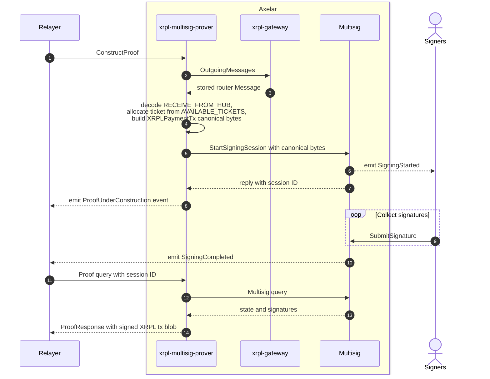
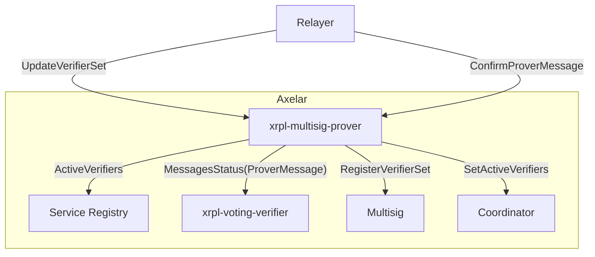
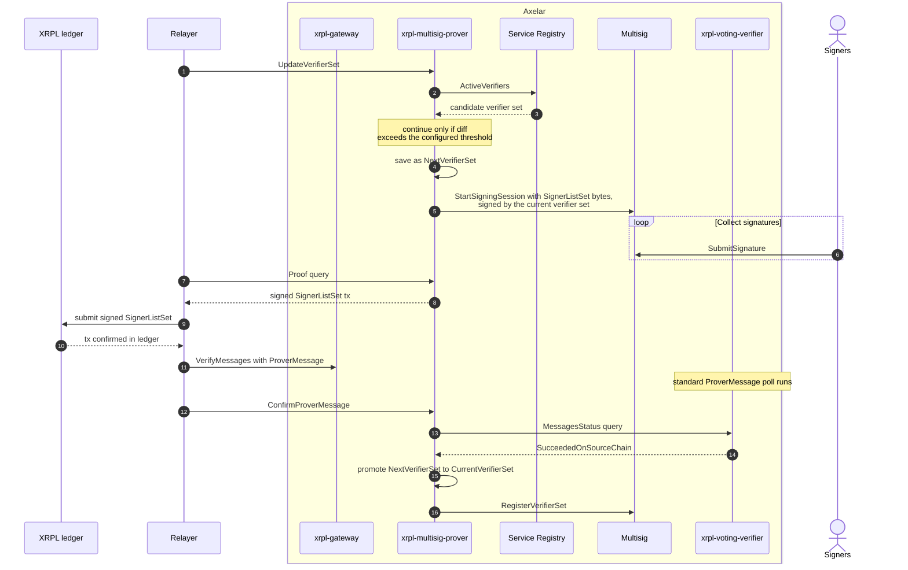

# XRPL Multisig Prover

Source: [`contracts/xrpl-multisig-prover`](https://github.com/axelarnetwork/axelar-amplifier-xrpl/tree/main/contracts/xrpl-multisig-prover).

The XRPL Multisig Prover constructs **fully-canonical XRPL transactions** that the on-XRPL multi sign account submits to deliver Axelar-to-XRPL traffic. On other Amplifier chains the prover only has to produce an `execute_data` blob that the destination chain's gateway will then verify and execute; on XRPL there is no destination contract to do that verification, so the prover's output **is the on-chain transaction itself**. The prover therefore also owns all the XRPL-specific bookkeeping that this implies: a pool of pre-allocated [tickets](../glossary.md#ticket) for parallel out-of-order in-flight transactions, an XRP [reserve](../glossary.md#reserve) budget for the multi sign account, trust line management for receiving local IOUs, and the current/next verifier set view used to populate the multi sign account's `SignerList`.

## What XRPL-specific work this contract absorbs compared to the generic prover

| Concern | Generic Multisig Prover | XRPL Multisig Prover |
| --- | --- | --- |
| ConstructProof / signing session lifecycle | Yes | Yes |
| UpdateVerifierSet / ConfirmVerifierSet | Yes (`ConfirmVerifierSet` from voting verifier) | Replaced by `ConfirmProverMessage` (verifier rotation rides a `SignerListSet` confirmation) |
| Output | Encoded calldata for destination chain's gateway | **An XRPL canonical-serialized transaction** (Payment / SignerListSet / TicketCreate / TrustSet) |
| Sequence management | N/A (no per-account nonce on Axelar side) | **Yes**: maintains `AVAILABLE_TICKETS` pool, `NEXT_SEQUENCE_NUMBER`, `LAST_ASSIGNED_TICKET_NUMBER` |
| Fee/reserve budget | N/A | **Yes**: `FEE_RESERVE` tracks the multi sign account's XRP balance budget; `ConfirmAddReservesMessage` credits top-ups |
| Per-token plumbing | N/A | **Yes**: `TrustSet` execute variant for opening trust lines so the multi sign account can receive a local-origin IOU |
| Proof status query | Returns full `ProofResponse` with `execute_data` | Returns `unsigned_tx_hash` plus `Completed { execute_data: signed XRPL tx blob }` |

## Interface

```Rust
pub struct InstantiateMsg {
    pub admin_address: String,
    pub governance_address: String,
    pub gateway_address: String,             // the xrpl-gateway
    pub multisig_address: String,            // the generic multisig contract
    pub coordinator_address: String,
    pub service_registry_address: String,
    pub voting_verifier_address: String,     // the xrpl-voting-verifier
    pub signing_threshold: MajorityThreshold,
    pub service_name: String,
    pub chain_name: ChainName,               // "xrpl"
    pub verifier_set_diff_threshold: u32,
    pub xrpl_multisig_address: XRPLAccountId,

    // XRPL-specific fee + reserve configuration.
    pub xrpl_transaction_fee: u64,           // base fee per signer; final tx fee = fee * (1 + n_signers)
    pub xrpl_base_reserve: u64,              // protocol base reserve
    pub xrpl_owner_reserve: u64,             // per-owned-object reserve
    pub initial_fee_reserve: u64,            // bootstrap budget

    // XRPL ticket pool bootstrap.
    pub ticket_count_threshold: u32,         // refill the pool when available count drops below this
    pub available_tickets: Vec<u32>,         // initial set of usable tickets
    pub next_sequence_number: u32,
    pub last_assigned_ticket_number: u32,
}

pub enum ExecuteMsg {
    // Build an XRPL Payment for a single outgoing message and open a signing session.
    // Permission: Any (the relayer calls this; gas is paid via accrued gas accounting).
    ConstructProof {
        cc_id: CrossChainId,
        payload: HexBinary,
    },

    // Trigger a verifier set rotation: build an XRPL SignerListSet signed by the
    // outgoing set. Permission: Elevated (admin or governance).
    UpdateVerifierSet,

    // Confirm that a prover-built XRPL transaction landed on the ledger.
    // After the xrpl-voting-verifier confirms the corresponding ProverMessage poll, the
    // relayer calls this to release the ticket, clear the payload, and (for SignerListSet)
    // promote NextVerifierSet -> CurrentVerifierSet. Permission: Any.
    ConfirmProverMessage { prover_message: XRPLProverMessage },

    // Credit a verified XRPLAddReservesMessage to FEE_RESERVE. Permission: Any.
    ConfirmAddReservesMessage { add_reserves_message: XRPLAddReservesMessage },

    // Build an XRPL TicketCreate transaction. Permission: Any (the relayer calls when the
    // pool drops below threshold; the contract decides internally how many to mint).
    TicketCreate,

    // Build an XRPL TrustSet transaction for the multi sign account to be able to hold
    // the given local-origin IOU. Permission: Elevated.
    TrustSet { token_id: TokenId },

    // Admin / parameter updates.
    DisableExecution,                                        // Elevated
    EnableExecution,                                         // Elevated
    UpdateFeeReserve { new_fee_reserve: u64 },               // Elevated
    UpdateSigningThreshold {                                 // Governance
        new_signing_threshold: MajorityThreshold,
    },
    UpdateXrplTransactionFee { new_transaction_fee: u64 },   // Elevated
    UpdateXrplReserves {                                     // Elevated
        new_base_reserve: u64,
        new_owner_reserve: u64,
    },
    UpdateAdmin { new_admin_address: String },               // Elevated

    // Verifies a signature against an XRPL multi-sign digest (which includes the signer's
    // own XRPL address). Used by the multisig contract during signature submission when
    // sig_verifier is set. Permission: Any.
    VerifySignature {
        signature: HexBinary,
        message: HexBinary,
        public_key: HexBinary,
        signer_address: String,
        session_id: Uint64,
    },
}

pub enum QueryMsg {
    // Returns the unsigned tx hash and either ProofStatus::Pending or
    // ProofStatus::Completed { execute_data: <signed XRPL tx blob> }.
    Proof { multisig_session_id: Uint64 },

    // Same XRPL-specific signature check as the execute variant, callable as a query.
    VerifySignature { /* same args */ },

    // The current active verifier set view (the one mirrored into the XRPL SignerList).
    CurrentVerifierSet,

    // The pending NextVerifierSet, if a rotation is in progress.
    NextVerifierSet,

    // Look up the in-flight multisig session for a specific cc_id.
    MultisigSession { cc_id: CrossChainId },

    // Recommends how many tickets the next TicketCreate should produce. 0 means no refill needed.
    TicketCreate,

    IsEnabled,

    AvailableTickets,
    NextSequenceNumber,
    FeeReserve,
}

pub struct ProofResponse {
    pub unsigned_tx_hash: HexTxHash,
    pub status: ProofStatus,
}

pub enum ProofStatus {
    Pending,
    Completed { execute_data: HexBinary },
}
```

## Proof construction sequence



### General steps

1. The relayer calls `ConstructProof(cc_id, payload)` after the ITS Hub has routed an inbound message into the XRPL Gateway's `OUTGOING_MESSAGES` map.
2. The prover queries the XRPL Gateway for the stored message, decodes `HubMessage::ReceiveFromHub(InterchainTransfer)`, and verifies `data` is empty (XRPL has no executable destination; the multisig prover rejects payloads).
3. It parses the destination as a classic XRPL address, converts the amount into the right [`XRPLPaymentAmount`](../glossary.md#xrp) (drops for XRP, or 54-bit-mantissa + exponent for an IOU), allocates a [ticket](../glossary.md#ticket) from `AVAILABLE_TICKETS`, and builds an XRPL Payment transaction whose `Sequence` field is the allocated ticket.
4. The prover opens a signing session at the generic [`multisig`](multisig.md) contract, passing the XRPL canonical serialization as the message to sign. **Each verifier signs a slightly different digest**, because XRPL multi-signing requires appending the signer's own XRPL account id to the canonical bytes before the SHA-512-half hash.
5. Once quorum is reached, the relayer queries `Proof { multisig_session_id }` and gets back `ProofStatus::Completed { execute_data: <signed XRPL tx blob> }`. It then broadcasts the blob to the XRPL ledger.
6. The relayer's subscriber sees the multi sign account's outbound transaction land on the ledger and reports it back via `VerifyMessages` with a `ProverMessage`. Once the [XRPL Voting Verifier](xrpl_voting_verifier.md) confirms it, the relayer calls `ConfirmProverMessage` which releases the ticket and clears the stored payload.

## Update and confirm VerifierSet graph



## Update and confirm VerifierSet sequence



### General steps

1. The relayer (or governance) calls `UpdateVerifierSet`.
2. The prover queries the [Service Registry](service_registry.md) for the active verifier set for chain `xrpl`. If the diff against the current set exceeds `verifier_set_diff_threshold`, the candidate becomes the prover's `NextVerifierSet`.
3. The prover builds an XRPL `SignerListSet` transaction that mirrors the new verifier set into the multi sign account's on-XRPL `SignerList`, with weights scaled to fit XRPL's `u16` weight field, and a quorum derived from the prover's `signing_threshold`. The transaction is signed by the **outgoing** verifier set.
4. The relayer broadcasts the signed `SignerListSet` to the XRPL ledger. The transaction inclusion is then reported back to Axelar as a `ProverMessage` and confirmed through the standard `VerifyMessages` poll machinery.
5. `ConfirmProverMessage` is called after the poll reaches quorum. The prover promotes `NextVerifierSet` to `CurrentVerifierSet`, calls `RegisterVerifierSet` on the generic [`multisig`](multisig.md) contract so subsequent signing sessions reference the new set, and pushes the new set to the [Coordinator](coordinator.md) via `SetActiveVerifiers` for cross-chain bookkeeping.

## Why ConfirmProverMessage replaces the generic ConfirmVerifierSet

On the generic prover, after a `rotateSigners` calldata is broadcast to the destination chain, the destination's gateway emits a `SignersRotated` event which is verified by the destination chain's voting verifier. `ConfirmVerifierSet` reads that result and promotes the set. On XRPL there is no contract to emit an event: a `SignerListSet` transaction landing in the ledger **is** the event. The prover unifies this with the generic message-confirmation path by treating every prover-built outbound XRPL transaction (Payment, SignerListSet, TicketCreate, TrustSet) as a `ProverMessage` that the [XRPL Voting Verifier](xrpl_voting_verifier.md) polls on. `ConfirmProverMessage` then dispatches on the inner transaction type to release the ticket, promote the verifier set, refresh available tickets, or activate a trust line.

## Tickets, sequence numbers, and fee reserve

XRPL has a strict per-account `Sequence` (like an EVM nonce). To allow multiple in-flight bridge transactions and out-of-order confirmation, the prover uses **tickets**: pre-allocated sequence numbers from a pool of up to 250.

| Transaction type | Sequence field | Why |
| --- | --- | --- |
| Payment | Ticket | Many in flight; can confirm out-of-order |
| TicketCreate | Plain sequence | Refills the ticket pool; must be strictly ordered |
| SignerListSet | Plain sequence | Verifier set rotation; one at a time |
| TrustSet | Plain sequence | One trust line at a time |

The `FEE_RESERVE` counter (in XRP drops) tracks the multi sign account's available XRP. Every new transaction is gated by `ensure_sufficient_fee_reserve` against `xrpl_base_reserve + xrpl_owner_reserve * (251 + trust_line_count) + tx_fee`. `ConfirmAddReservesMessage` is called after the [XRPL Voting Verifier](xrpl_voting_verifier.md) confirms an operator-initiated XRP top-up.
