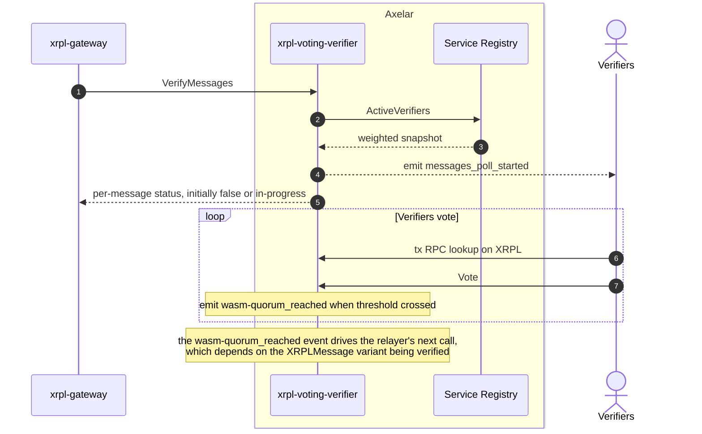

# XRPL Voting Verifier

Source: [`contracts/xrpl-voting-verifier`](https://github.com/axelarnetwork/axelar-amplifier-xrpl/tree/main/contracts/xrpl-voting-verifier).

The XRPL Voting Verifier runs stake-weighted polls over XRPL transactions. Each poll asks the active verifier set whether a specific XRPL transaction happened on the XRPL ledger, what its outcome was, and whether its contents match the message under verification. Off chain, each verifier's [`ampd`](../glossary.md#ampd) handler fetches the cited transaction over XRPL JSON RPC, applies XRPL-specific consistency checks, and casts a `Vote`. Quorum results are stored on chain and queried by the XRPL Gateway (or, for `ProverMessage` polls, indirectly used by the XRPL Multisig Prover) to decide what to do next.

## What XRPL-specific work this contract absorbs compared to the generic voting verifier

| Concern | Generic Voting Verifier | XRPL Voting Verifier |
| --- | --- | --- |
| Stake-weighted polls | Yes | Yes |
| Vote / EndPoll / VerifyMessages interface | Yes | Yes |
| Message type | Generic `router_api::Message` | **XRPL-native** `XRPLMessage` enum (five variants), so a single poll can cover inbound user payments, outbound prover transactions, gas top-ups, and reserve top-ups |
| Verifier set update polls | Separate `VerifyVerifierSet` execute variant | **Not needed**: verifier set rotation rides on a `ProverMessage(SignerListSet)` poll, no separate variant |
| `source_gateway_address` field type | `String` | **`XRPLAccountId`** — type-safe XRPL classic address |
| `confirmation_height` type | `u64` | `u32` (sufficient for XRPL ledger indexes) |
| Parameter updates | Multiple split-out execute variants in upstream; older `UpdateVotingThreshold` here | Unified [`UpdateVotingParameters`](../glossary.md#axelar-gmp-api) with `Option`-typed fields for selective updates |
| Admin / killswitch | Not in the upstream version inherited here | **Yes**: `UpdateAdmin`, `EnableExecution`, `DisableExecution` |

## Interface

```Rust
pub struct InstantiateMsg {
    pub admin_address: nonempty::String,
    pub governance_address: nonempty::String,
    pub service_registry_address: nonempty::String,
    pub service_name: nonempty::String,
    // The XRPL multisig classic address. Type-safe, distinct from a generic string.
    pub source_gateway_address: XRPLAccountId,
    pub voting_threshold: MajorityThreshold,
    pub block_expiry: nonempty::Uint64,
    pub confirmation_height: u32,
    pub source_chain: ChainName,
}

pub enum ExecuteMsg {
    // Compute the results of a poll. Anyone can call. Emits a PollEnded event.
    // Permission: Any.
    EndPoll { poll_id: PollId },

    // Cast votes for the specified poll. Caller must be a participant in the snapshot.
    // Permission: Any (the snapshot check happens during execution).
    Vote { poll_id: PollId, votes: Vec<Vote> },

    // Return a per-message verification status, opening a poll for any not-yet-verified
    // messages. Called by the XRPL Gateway. Permission: Any.
    VerifyMessages(Vec<XRPLMessage>),

    // Update voting parameters. Each field is Option so callers can patch a subset.
    // Changes apply to future polls only. Permission: Governance.
    UpdateVotingParameters {
        voting_threshold: Option<MajorityThreshold>,
        block_expiry: Option<nonempty::Uint64>,
        confirmation_height: Option<u32>,
    },

    // Killswitch and admin rotation. Permission: Elevated.
    EnableExecution,
    DisableExecution,
    UpdateAdmin { new_admin_address: String },
}

pub enum QueryMsg {
    // Returns the poll state, the messages it covers, and its status (in progress / finished).
    Poll { poll_id: PollId },

    // Returns the verification status of each input XRPLMessage.
    MessagesStatus(Vec<XRPLMessage>),

    // Returns the currently active voting threshold, block expiry, and confirmation height.
    VotingParameters,
}

pub enum PollData {
    Messages(Vec<XRPLMessage>),
}

pub struct PollResponse {
    pub poll: WeightedPoll,
    pub data: PollData,
    pub status: PollStatus,
}

pub struct MessageStatus {
    pub message: XRPLMessage,
    pub status: VerificationStatus,
}
```

## Verification sequence



## General steps

1. The XRPL Gateway forwards an array of `XRPLMessage`s via `VerifyMessages`. For any message that already has a final status (e.g., `SucceededOnSourceChain`), no poll is opened; only unverified messages produce a new poll.
2. The voting verifier takes a weighted snapshot of the active verifiers for chain `xrpl` from the [Service Registry](service_registry.md). The snapshot is bound to the poll for its entire lifetime.
3. A `messages_poll_started` event is emitted carrying the candidate `XRPLMessage`s. Off chain, each verifier's XRPL handler picks the event up, fetches the cited XRPL transactions via JSON RPC, runs XRPL-specific consistency checks (multi-sign destination, `delivered_amount == Amount` to close the [`tfPartialPayment`](../glossary.md#tfpartialpayment) exploit, memo parsing, payload hash), and casts a `Vote`.
4. The moment a vote pushes weighted tally past quorum, the contract emits a `wasm-quorum_reached` event. The [Axelar GMP API](../glossary.md#axelar-gmp-api) delivers a task to the XRPL relayer. The relayer's next action depends on the `XRPLMessage` variant: for `InterchainTransferMessage` or `CallContractMessage` it calls `RouteIncomingMessages` on the gateway; for `ProverMessage` it calls `ConfirmProverMessage` on the multisig prover.
5. `EndPoll` is called separately to finalize the poll status. It is not on the critical path for routing.

## Why there's no `VerifyVerifierSet` variant

On the generic [`voting-verifier`](voting_verifier.md), verifier set rotations are confirmed by a separate `VerifyVerifierSet` execute variant that opens a different kind of poll. On XRPL the gateway is an XRPL account, not a contract, so the rotation event is the inclusion of a `SignerListSet` transaction on the XRPL ledger. That inclusion is reported back to Axelar as a `ProverMessage` (with the `SignerListSet` unsigned tx hash) and confirmed through the same `VerifyMessages` poll machinery used for any other XRPL transaction. The verifier set rotation is then promoted by the multisig prover's `ConfirmProverMessage` handler.
