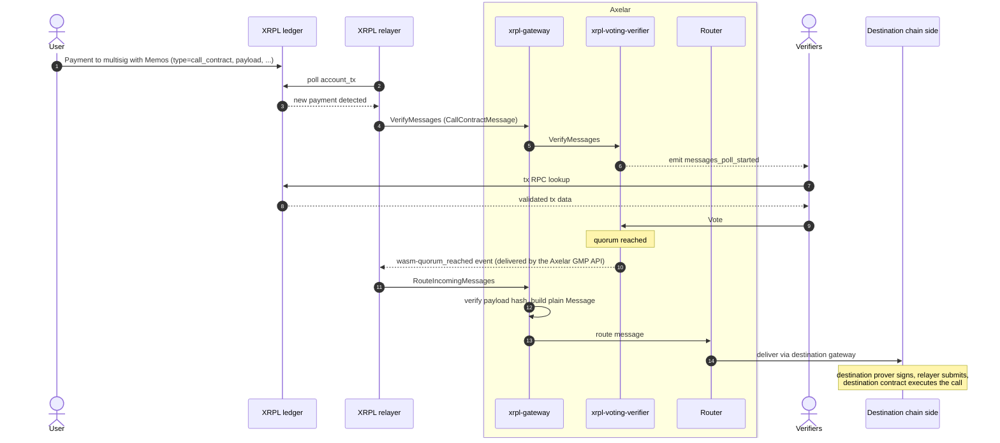
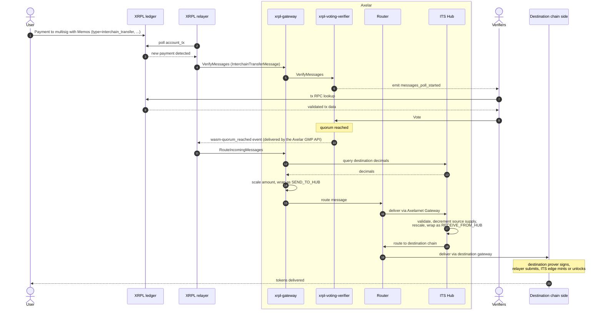
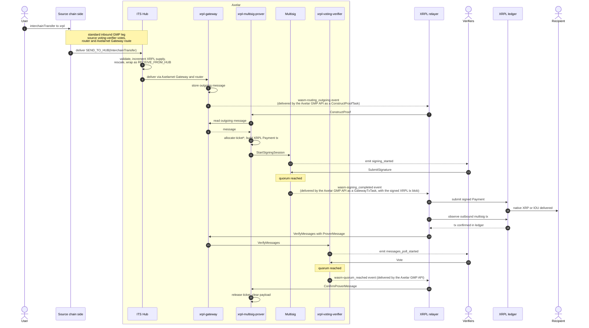

# Message Flows to and from XRPL

This document gives a high level walkthrough of what happens when a cross chain message moves from XRPL to another chain connected to Axelar, or from another chain to XRPL. Deeper, per contract documentation lives in the [contracts referenced](#contracts-referenced) section linked at the bottom.

The integration uses the same Axelar Amplifier protocol that other chains plug into, but XRPL has a unique design because it does not have smart contracts. Everything that would normally be done by an on chain "gateway" contract on the external chain is done instead by a single XRPL **multisig account**, controlled by the active Axelar verifier set. So, unlike most other integrations where the chain-specific logic lives on the edge chain contracts, in this case the XRPL-specific logic lives in three CosmWasm contracts deployed on Axelar.

For unfamiliar XRPL or Axelar terminology, the [glossary](glossary.md) gives a short definition. Linked terms throughout the document point into that glossary.

Three flows are described below. Flow A covers a pure general message passing (GMP) call originating on XRPL with no token transfer attached. Flow B covers an Interchain Token Service (ITS) transfer from XRPL to a destination chain. Flow C covers an ITS transfer in the reverse direction: from a source chain to XRPL. There is no inbound pure GMP flow because XRPL has no executable destination; only ITS token deliveries land on XRPL.

## Three Axelar resident contracts do the XRPL specific work

The three XRPL contracts absorb every responsibility that would otherwise live in chain side contracts on a smart contract chain:

* [`xrpl-gateway`](contracts/xrpl_gateway.md) is the entry and exit point for XRPL messages on Axelar. It is also the [ITS edge](glossary.md#its-edge) for XRPL (the role that on other chains is split out into a separate contract). It accepts inbound messages from a relayer, asks the voting verifier to confirm them, translates them into ITS Hub messages, and forwards them through the router. In the other direction it stores outbound messages received from the router for the prover to pick up.
* [`xrpl-voting-verifier`](contracts/xrpl_voting_verifier.md) runs [polls](glossary.md#poll) over XRPL transactions. The off chain XRPL handler reads the ledger via JSON RPC and votes.
* [`xrpl-multisig-prover`](contracts/xrpl_multisig_prover.md) builds the XRPL transactions that the multi sign account needs to send, opens signing sessions on the generic [`multisig`](contracts/multisig.md) contract, and tracks XRPL specific state (the [ticket](glossary.md#ticket) pool, the [reserve](glossary.md#reserve) budget, trust lines, and the current and next verifier set).

The rest of the protocol is unchanged from the upstream Amplifier. The generic [`router`](contracts/router.md), [`multisig`](contracts/multisig.md), [`service-registry`](contracts/service_registry.md), [`coordinator`](contracts/coordinator.md), and [`rewards`](contracts/rewards.md) contracts behave exactly as they do for any other chain. The [Axelarnet Gateway](https://github.com/axelarnetwork/axelar-amplifier/tree/main/contracts/axelarnet-gateway) and the [ITS Hub](https://github.com/axelarnetwork/axelar-amplifier/tree/main/contracts/interchain-token-service) live in the canonical [`axelar-amplifier`](https://github.com/axelarnetwork/axelar-amplifier) repository and are shared infrastructure used by every chain.

Off chain, two distinct processes do the work that bridges the two ledgers:

* **The verifiers running [ampd](glossary.md#ampd)**: the same off chain daemon every Amplifier verifier already runs for every chain. For XRPL they additionally run an XRPL specific handler binary that watches the Axelar chain for poll events, looks up the cited XRPL transactions via JSON RPC, and votes. The same handler also signs outbound XRPL transactions when the multisig prover opens a signing session.
* **The XRPL relayer**: a set of Rust services that monitor the XRPL ledger for activity on the multi sign account, push relevant transactions to the Axelar chain contracts, and submit prover produced XRPL transactions back to the ledger. Relaying is permissionless; anyone can run the same software.

## How a user signals intent on XRPL

Because XRPL cannot host a `callContract` style entry point, the user expresses their intent through the only primitive XRPL gives them: an XRPL `Payment` transaction. The payment is addressed to the multi sign account. Structured [`Memos`](glossary.md#memos) on the payment tell the bridge what to do.

For an interchain token transfer the memo schema is:

| Memo key | Required | Meaning |
| --- | --- | --- |
| `type` | yes | The literal `interchain_transfer` (or `call_contract` for a pure GMP call) |
| `destination_chain` | yes | The case sensitive chain name |
| `destination_address` | yes | The recipient address on the destination chain, hex encoded, without any leading `0x` |
| `gas_fee_amount` | yes | How much of the payment is gas, in the same denomination as the `Amount` field |
| `payload` | optional | An ABI encoded payload, only present for general message passing calls that carry data |

The full `Amount` field of the `Payment` is the sum of the transfer amount and the gas fee. The gas fee is later deducted on Axelar by the gateway when accounting accrued gas per token id.

## Flow A: GMP from XRPL to a destination chain

A user on XRPL wants to make a pure general message passing call to a contract on another Axelar connected chain. No tokens are transferred; only an opaque payload is delivered to the destination contract. This is signalled with the `call_contract` memo type. The entire `Amount` of the XRPL `Payment` is treated as the gas fee for the cross chain call.

### Sequence

### General steps

1. **User Payment to the multi sign account.** The user signs and submits an XRPL `Payment` to the multi sign account. Required [memos](glossary.md#memos): `type=call_contract`, `destination_chain`, `destination_address` (raw bytes of the destination contract, hex encoded), `gas_fee_amount` (equal to `Amount`, since the whole payment is gas), and `payload` (ABI encoded calldata for the destination contract). The XRPL transaction hash becomes the [cross chain id](glossary.md#cross-chain-id-cc_id) for the rest of the flow.

2. **Off chain detection.** The XRPL [relayer](glossary.md#relayer) polls [`account_tx`](glossary.md#account_tx) on the multi sign account, sees the new payment, classifies it by memo `type` as a `CallContractMessage`, and calls `VerifyMessages` on the [`xrpl-gateway`](contracts/xrpl_gateway.md).

3. **The voting verifier opens a poll.** The gateway forwards the `CallContractMessage` to the [`xrpl-voting-verifier`](contracts/xrpl_voting_verifier.md), which takes a weighted snapshot of the [active verifiers](contracts/service_registry.md) for chain `xrpl` and emits a `messages_poll_started` event.

4. **Verifiers vote.** Each [verifier](glossary.md#verifier) running [`ampd`](glossary.md#ampd) and the XRPL handler fetches the cited XRPL transaction and checks: the transaction is `validated`, its destination is the multi sign account, `delivered_amount` equals `Amount` (defends against [`tfPartialPayment`](glossary.md#tfpartialpayment)), the memos parse correctly, the `gas_fee_amount` equals `Amount` (no transfer component), and `keccak256(payload)` matches the message's payload hash. The handler casts a `Vote`. As soon as quorum is reached, the voting verifier emits `wasm-quorum_reached`.

5. **Routing to the destination chain.** The [Axelar GMP API](glossary.md#axelar-gmp-api) pushes the `wasm-quorum_reached` task to the relayer, which calls `RouteIncomingMessages` on the [`xrpl-gateway`](contracts/xrpl_gateway.md). For each verified `CallContractMessage` the gateway builds a plain `router_api::Message` carrying the original `source_address` (the XRPL user), the user supplied `destination_chain` and `destination_address`, and `payload_hash = keccak256(payload)`. The message is handed straight to the generic [`router`](contracts/router.md).

6. **Outbound GMP leg.** From here the flow is identical to any other outbound Amplifier GMP. The router delivers to the destination chain's gateway slot; the destination chain's [`multisig-prover`](contracts/multisig_prover.md) constructs `execute_data` for that chain's gateway; the generic [`multisig`](contracts/multisig.md) contract collects signatures; a relayer broadcasts the `execute_data` to the destination's Axelar Gateway. The [upstream Amplifier overview](https://github.com/axelarnetwork/axelar-amplifier/blob/main/doc/src/overview.md) describes this leg.

7. **Delivery on the destination chain.** The destination's Axelar Gateway approves the message; the executor invokes the application contract at `destination_address` with the `payload`.

## About ITS

The remaining two flows use the **Interchain Token Service (ITS)**, a chain agnostic protocol layered on top of Amplifier GMP that handles the deployment, linking, and transfer of tokens across chains. ITS adds two pieces to a generic GMP message: a per-token identifier shared across chains, and a central routing contract on Axelar (the **ITS Hub**) that validates, tracks per chain supply, and rescales amounts between chains with different decimal precisions. The protocol is described in the upstream [ITS Hub](https://github.com/axelarnetwork/axelar-amplifier/tree/main/contracts/interchain-token-service) repository.

A very common ITS interaction on XRPL is moving native XRP to a smart contract chain and back, using **Wrapped XRP (wXRP)** as the destination representation such as XRPL-EVM:

* **From XRPL to XRPL-EVM**: a user pays native XRP to the XRPL multi sign account; the XRP is **locked** in the multisig (the multisig is the gateway, not the issuer); on the destination chain, the local ITS edge **mints** wXRP to the recipient.
* **From XRPL-EVM back to XRPL**: a user calls `interchainTransfer` on the XRPL-EVM ITS edge with their wXRP; the wXRP is **burned** locally; the XRPL multisig sends an equivalent amount of native XRP from its balance to the recipient on XRPL.

The same mechanism applies to other tokens: an XRPL-native [IOU](glossary.md#iou-issued-currency) bridged out is locked on XRPL and minted on the destination, and the reverse direction is the symmetric burn-and-unlock. The two flows below describe each direction in detail.

## Flow B: ITS transfer from XRPL to a destination chain

A user on XRPL wants to send value (native XRP or an IOU) to a recipient on another Axelar connected chain. In this flow XRPL is the source chain and the other chain is the destination. The route goes through the ITS Hub.

### Sequence

### General steps

1. **User Payment to the multi sign account.** The user signs and submits an ordinary XRPL `Payment` transaction whose destination is the multi sign account. The transaction's [memos](glossary.md#memos) encode the destination chain, the destination address (hex encoded raw bytes, since address formats differ across chains), the amount to allocate as gas, and optionally a payload for a [GMP](glossary.md#gmp-general-message-passing) call. The XRPL transaction hash becomes the [cross chain id](glossary.md#cross-chain-id-cc_id) for the rest of the flow. The user's own XRPL key signs the transaction; the multi sign account is the recipient, not the sender.

2. **Off chain detection.** The XRPL [relayer](glossary.md#relayer) polls the multi sign account's transaction history via XRPL's [`account_tx`](glossary.md#account_tx) RPC. When it detects a new payment, it classifies it by memo `type` and constructs an `InterchainTransferMessage` (or `CallContractMessage` for a pure GMP payload). It then calls `VerifyMessages` on the [`xrpl-gateway`](contracts/xrpl_gateway.md).

3. **The voting verifier opens a poll.** The gateway forwards the messages to the [`xrpl-voting-verifier`](contracts/xrpl_voting_verifier.md), which takes a snapshot of the active verifier set from the [service registry](contracts/service_registry.md) for chain `xrpl` and opens a [poll](glossary.md#poll). A `messages_poll_started` event is emitted, carrying the candidate messages.

4. **Verifiers vote.** Each [verifier](glossary.md#verifier) running [`ampd`](glossary.md#ampd) and the XRPL handler binary sees the poll event, fetches the cited XRPL transaction over its own XRPL JSON RPC connection, and checks several invariants: the transaction is `validated`, its destination is the multi sign account, `delivered_amount` equals `Amount` (which guards against the XRPL [`tfPartialPayment`](glossary.md#tfpartialpayment) exploit), the memos parse correctly, and the resulting message matches the one under poll. The handler then casts a `Vote`. The moment a vote pushes the weighted tally past the [quorum](glossary.md#quorum) threshold, the voting verifier emits a `wasm-quorum_reached` event and the message becomes queryable as `SucceededOnSourceChain` (the formal `EndPoll` call happens later, on a separate path, only for rewards bookkeeping).

5. **Routing into the ITS Hub.** Once the [Axelar GMP API](glossary.md#axelar-gmp-api) picks up the `wasm-quorum_reached` event, `RouteIncomingMessages` is called on the [`xrpl-gateway`](contracts/xrpl_gateway.md). For each verified message the gateway looks up the [token id](glossary.md#token-id) the message refers to, queries the [ITS Hub](https://github.com/axelarnetwork/axelar-amplifier/tree/main/contracts/interchain-token-service) for the destination chain's registered decimals so it can scale the amount correctly, and constructs a `HubMessage::SendToHub(InterchainTransfer)` payload. The wrapped message is handed to the generic [`router`](contracts/router.md), which delivers it to the [Axelarnet Gateway](https://github.com/axelarnetwork/axelar-amplifier/tree/main/contracts/axelarnet-gateway). The Axelarnet Gateway hands it to the ITS Hub for processing.

6. **ITS Hub processing.** The Hub validates that the source address is the registered XRPL [ITS edge](glossary.md#its-edge), decrements the per chain supply tally for the token, applies any further decimal scaling required by the destination chain, checks that neither side is frozen, and re wraps the inner message as `HubMessage::ReceiveFromHub(InterchainTransfer)`. It then calls `CallContract` on the Axelarnet Gateway again, addressed to the ITS edge on the destination chain.

7. **Second GMP leg leaves Axelar.** From this point the message is an ordinary outbound Amplifier GMP toward the destination chain. The destination chain's [`multisig-prover`](contracts/multisig_prover.md) constructs an `execute_data` blob, the generic [`multisig`](contracts/multisig.md) contract collects signatures from the active verifier set, and a relayer broadcasts the resulting calldata to the destination chain's gateway. This is the same machinery used by every other Amplifier chain. The [upstream Amplifier overview](https://github.com/axelarnetwork/axelar-amplifier/blob/main/doc/src/overview.md) describes this leg in detail.

8. **Delivery on the destination chain.** The destination chain's Axelar Gateway calls into the ITS edge contract, which decodes `RECEIVE_FROM_HUB(INTERCHAIN_TRANSFER)`, verifies that the original source chain is in its trusted chains list, and gives the recipient the tokens. The exact mechanism depends on the local token manager type (mint, unlock, and so on). If the original payment carried a `payload` memo, the ITS edge additionally calls an executable hook on the recipient contract.

## Flow C: ITS transfer from a source chain to XRPL

A user on another Axelar connected chain wants to send value to a recipient on XRPL. In this flow the other chain is the source and XRPL is the destination. Because the XRPL ledger does not run arbitrary code, the destination side of the flow is the multi sign account submitting a signed XRPL `Payment` to the recipient.

### Sequence

\* For background on why XRPL transactions use tickets and how the pool is managed, see [Ticket](glossary.md#ticket) in the glossary.

### General steps

1. **User call on the source chain.** The user invokes the ITS edge contract on their source chain with an interchain transfer call whose destination chain is `xrpl` and whose destination address is the recipient's [classic XRPL address](glossary.md#classic-address) encoded as raw bytes. The local [token manager](glossary.md#token-manager) burns or locks the user's tokens, depending on the manager type configured for that token id.

2. **First GMP leg leaves the source chain.** The source ITS edge wraps an `INTERCHAIN_TRANSFER` payload in a `SEND_TO_HUB` envelope and calls `callContract("axelar", ITS Hub address, payload)` on the source chain's Axelar gateway. Verifiers observe the resulting on chain event, the voting verifier on the source chain side reaches quorum, the router routes the message into the Axelarnet Gateway, and the Axelarnet Gateway calls Execute on the ITS Hub. This is the same machinery used for any source chain. See the [upstream Amplifier overview](https://github.com/axelarnetwork/axelar-amplifier/blob/main/doc/src/overview.md), the generic [`gateway`](contracts/gateway.md), and the generic [`multisig-prover`](contracts/multisig_prover.md) for context.

3. **ITS Hub processing.** The Hub validates the source ITS edge, increments the registered supply for the XRPL token instance, rescales the amount into XRPL's six decimals (native XRP) or the IOU exponent format, checks neither side is frozen, and re wraps the inner message as `HubMessage::ReceiveFromHub(InterchainTransfer)`. It then calls `CallContract` again, addressed to the [`xrpl-gateway`](contracts/xrpl_gateway.md) on Axelar.

4. **Outgoing message lands on the xrpl-gateway.** The router delivers the message to the [`xrpl-gateway`](contracts/xrpl_gateway.md). The gateway stores it in its `OUTGOING_MESSAGES` map keyed by [`cc_id`](glossary.md#cross-chain-id-cc_id). From this point the message is queued for inclusion in the next XRPL transaction the multisig prover builds.

5. **Prover constructs an XRPL Payment.** Storing the outgoing message causes the [`xrpl-gateway`](contracts/xrpl_gateway.md) to emit a `wasm-routing_outgoing` event. The [Axelar GMP API](glossary.md#axelar-gmp-api) picks the event up and pushes a `ConstructProofTask` to the relayer, which responds by calling `ConstructProof(cc_id, payload)` on the [`xrpl-multisig-prover`](contracts/xrpl_multisig_prover.md). The prover fetches the message from the gateway, decodes `ReceiveFromHub(InterchainTransfer)`, checks that the inner `data` field is empty (general message passing into XRPL is not supported, since XRPL has no executable destination), parses the destination as a classic XRPL address, converts the amount into the appropriate XRPL payment value (native [drops](glossary.md#drop) or an [IOU](glossary.md#iou-issued-currency) with a 54 bit mantissa and exponent — see [Supported Values and Tokens on XRPL](tokens-and-amounts.md) for the full conversion rules and constraints), allocates a [ticket](glossary.md#ticket) from its available ticket pool, and builds an XRPL Payment transaction whose sequence field is the allocated ticket.

6. **Signing session opens.** The prover calls `StartSigningSession` on the generic [`multisig`](contracts/multisig.md) contract. The blob the signers must sign is the XRPL [canonical serialization](glossary.md#canonical-serialization) of the unsigned transaction. Each verifier signs a slightly different digest, because XRPL multi signing requires each signer's own XRPL account address to be appended to the canonical blob before hashing with [SHA 512 half](glossary.md#sha-512-half). Verifiers run the XRPL multisig handler under [ampd](glossary.md#ampd). They read the signing session event, compute the per signer digest, hand it to [tofnd](glossary.md#tofnd) for signing, and submit the resulting signature back to the multisig contract. Quorum follows the rules in [`service-registry`](contracts/service_registry.md).

7. **Submission to XRPL.** Once the multisig session reaches quorum, the generic [`multisig`](contracts/multisig.md) contract emits a `wasm-signing_completed` event. The [Axelar GMP API](glossary.md#axelar-gmp-api) picks it up, assembles the collected signatures into the final multi signed XRPL transaction blob, and pushes a `GatewayTxTask` containing that blob to the relayer's includer. The includer submits the blob to the XRPL ledger as a `Payment` from the multi sign account to the recipient. For native XRP this delivers drops directly. For a remote origin IOU (a token whose XRPL representation is issued by the multi sign account itself), the recipient must already have a [`TrustSet`](glossary.md#trustset) open against the multi sign account for the relevant [currency code](glossary.md#currency-code), otherwise XRPL rejects the payment.

8. **Confirmation of delivery on Axelar.** Confirmation of an outbound XRPL transaction is implicit. The relayer's subscriber sees the multi sign account's own outbound payment when it next polls, and the relayer reports it back to Axelar by calling `VerifyMessages` on the [`xrpl-gateway`](contracts/xrpl_gateway.md) with a [`ProverMessage`](glossary.md#provermessage) variant. The gateway forwards it to the [`xrpl-voting-verifier`](contracts/xrpl_voting_verifier.md) which opens a poll on this new message; verifiers confirm that the transaction landed on XRPL with the expected unsigned tx hash. Once quorum is reached, the voting verifier emits a `wasm-quorum_reached` event; the [Axelar GMP API](glossary.md#axelar-gmp-api) pushes the corresponding task to the relayer, which responds by calling `ConfirmProverMessage` on the [`xrpl-multisig-prover`](contracts/xrpl_multisig_prover.md). The ticket used by the transaction is released back into the available pool, and the payload is cleared. If the verifiers report `FailedOnChain` instead of `Succeeded`, the ticket is still consumed, but the payload stays stored so it can be retried or the value refunded.

For unfamiliar terms used in this document, see the [glossary](glossary.md).

## Contracts referenced

### XRPL specific (per contract pages to come)

* [`xrpl-gateway`](contracts/xrpl_gateway.md): entry and exit point on Axelar for XRPL traffic, and the ITS edge.
* [`xrpl-voting-verifier`](contracts/xrpl_voting_verifier.md): stake weighted polls over XRPL transactions, including outbound prover transactions.
* [`xrpl-multisig-prover`](contracts/xrpl_multisig_prover.md): builds XRPL transactions, manages tickets, the fee reserve, trust lines, and verifier set rotation.

### Generic Amplifier (in this book)

* [`router`](contracts/router.md)
* [`multisig`](contracts/multisig.md)
* [`voting-verifier`](contracts/voting_verifier.md) (generic, for context)
* [`multisig-prover`](contracts/multisig_prover.md) (generic, used by the destination chain in Flows A and B)
* [`gateway`](contracts/gateway.md) (generic, used by the destination chain in Flows A and B, and by the source chain in Flow C)
* [`service-registry`](contracts/service_registry.md)
* [`coordinator`](contracts/coordinator.md)
* [`rewards`](contracts/rewards.md)

### Generic Amplifier (canonical source upstream)

* [Axelarnet Gateway](https://github.com/axelarnetwork/axelar-amplifier/tree/main/contracts/axelarnet-gateway): the contract that lets Axelar resident contracts (including the ITS Hub) send and receive cross chain messages through the generic router.
* [ITS Hub](https://github.com/axelarnetwork/axelar-amplifier/tree/main/contracts/interchain-token-service): the chain agnostic router for ITS messages; tracks per chain supply and rescales decimals.
* [Upstream Amplifier overview](https://github.com/axelarnetwork/axelar-amplifier/blob/main/doc/src/overview.md): for the generic on chain message flow that both legs of every XRPL transfer ride on top of.
* [ampd](https://github.com/axelarnetwork/axelar-amplifier/tree/main/ampd): the off chain verifier daemon framework, and the [XRPL handler binary](https://github.com/axelarnetwork/axelar-amplifier/tree/main/ampd-handlers/src/bin/xrpl) that plugs into it for XRPL specific verification and signing.
