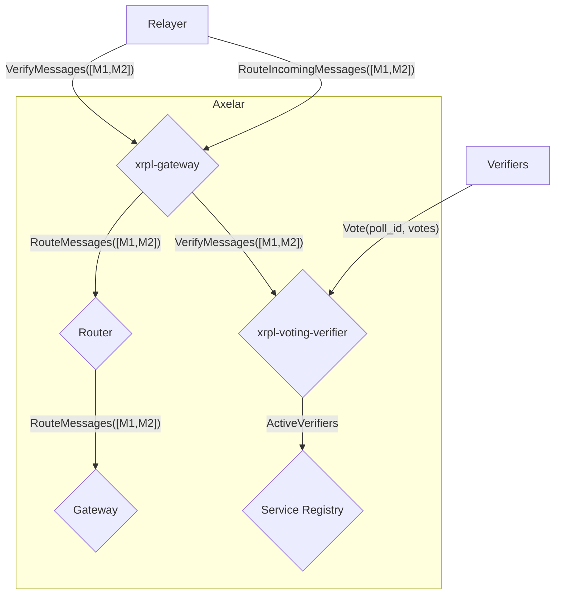
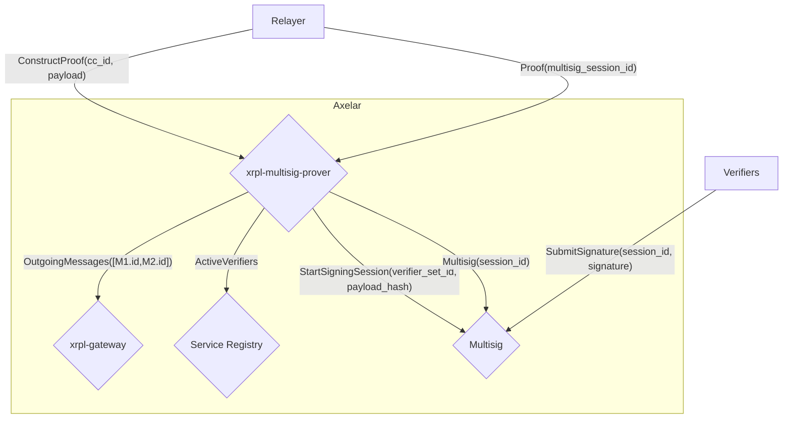

# Amplifier Protocol Overview

The Axelar Amplifier protocol is a set of CosmWasm contracts on the Axelar chain that lets any external chain connect to the Axelar interchain network without changes to Axelar's core. Each connected chain plugs in through a small group of per-chain contracts (Gateway, Voting Verifier, and Multisig Prover) used to verify and route messages to a destination chain. Combined with the Interchain Token Service Hub, the same machinery carries both General Message Passing calls and interchain token transfers.

XRPL is different because it has no smart contract layer. Instead, the XRPL gateway is implemented as a multisign account whose signers are the active Axelar verifier set, and that signer set is kept in sync by `SignerListSet` transactions on XRPL. Users initiate cross-chain actions by sending an XRPL `Payment` to that account with structured `Memos`; the Amplifier side then processes the transaction through the three XRPL-specific contracts ([xrpl-gateway](contracts/xrpl_gateway.md), [xrpl-voting-verifier](contracts/xrpl_voting_verifier.md), [xrpl-multisig-prover](contracts/xrpl_multisig_prover.md)), along with the generic Amplifier contracts and the ITS Hub.

## High Level Architecture

### Incoming Flow



### Outgoing Flow



For the message-level walkthroughs of each direction, see [Message Flows to and from XRPL](message-flows.md).

## Contract Overview

### Gateway
[`xrpl-gateway`](contracts/xrpl_gateway.md) is the entry and exit point on Axelar for XRPL traffic. It accepts inbound XRPL messages from the relayer for verification, routes verified user-payment variants through the router (and through the ITS Hub for token transfers), confirms gas top-ups, and stores outbound messages from the router for the multisig prover to pick up. It also acts as the ITS edge for XRPL: it holds the token-id registry, queries the ITS Hub for destination decimals, scales amounts between chains, and tracks accrued gas per token id.

### Voting Verifier
[`xrpl-voting-verifier`](contracts/xrpl_voting_verifier.md) runs stake-weighted polls over XRPL transactions for all five `XRPLMessage` variants. When the xrpl-gateway calls `VerifyMessages`, the voting verifier opens a poll, takes a weighted snapshot of the active verifier set from the service registry, and emits a `messages_poll_started` event. Off-chain verifiers cast their votes; once quorum is reached, the contract emits `wasm-quorum_reached`, which is what triggers the relayer's next action (routing or confirmation, depending on the message variant).

### Multisig Prover
[`xrpl-multisig-prover`](contracts/xrpl_multisig_prover.md) builds the XRPL transactions that the multisig account needs to send: `Payment` for token deliveries, `SignerListSet` for verifier set rotation, `TicketCreate` to refill the ticket pool, and `TrustSet` to open trust lines for XRPL-native IOUs. It opens signing sessions on the generic multisig contract, manages the available-ticket pool and sequence numbers, tracks the XRP fee reserve that funds outbound transaction fees, and holds the current/next verifier set.

### Router
[`router`](contracts/router.md) maintains the registry of connected chains and their gateways and routes verified messages between them. The xrpl-gateway is a registered chain gateway and uses it both inbound (delivering verified messages on toward the ITS Hub or directly to a destination chain) and outbound (receiving messages whose destination is XRPL from other source chains).

### Multisig
[`multisig`](contracts/multisig.md) is the generic CosmWasm contract on Axelar that coordinates signing sessions. The xrpl-multisig-prover creates a session whenever it builds a new XRPL transaction; verifiers submit per-signer signature shares; once quorum is met the contract emits `signing_completed` and publishes the assembled signatures.

### Service Registry
[`service-registry`](contracts/service_registry.md) tracks verifier bonding, authorization, and per-chain support. The xrpl-voting-verifier and xrpl-multisig-prover both query it for the active verifier set when opening polls and signing sessions.

### Coordinator
[`coordinator`](contracts/coordinator.md) tracks per-chain prover registrations and the verifier sets active on each chain. It serves as the unbonding gate for the service registry, so verifiers cannot withdraw stake while still active on any chain.

### Axelarnet Gateway
The [Axelarnet Gateway](https://github.com/axelarnetwork/axelar-amplifier/tree/main/contracts/axelarnet-gateway) (in the upstream repo) is the contract through which Axelar-resident contracts such as the ITS Hub send and receive cross-chain messages via the generic router. Every ITS message in either direction between XRPL and another chain passes through it.

### ITS Hub
The [ITS Hub](https://github.com/axelarnetwork/axelar-amplifier/tree/main/contracts/interchain-token-service) (in the upstream repo) is the chain-agnostic router for Interchain Token Service messages. It validates the source ITS edge, tracks per-chain token supply, and rescales amounts between chains with different decimal precisions. The `xrpl-gateway` sends `SEND_TO_HUB` envelopes to this contract when translating an XRPL inbound interchain transfer; the Hub re-wraps them as `RECEIVE_FROM_HUB` for delivery to the destination chain. The same machinery runs in reverse when a source chain sends an ITS transfer destined for XRPL.

## Message Semantics

The [xrpl-gateway](contracts/xrpl_gateway.md) accepts an XRPL-native union type, `XRPLMessage`, whose variants capture the five categories of XRPL transactions the bridge cares about. User-facing variants like `InterchainTransferMessage` and `CallContractMessage` are translated into generic `router_api::Message` objects and forwarded through the router. `AddGasMessage` is also user-initiated: it tops up gas for an existing cross-chain message and is confirmed on the gateway, but it does not become a router message. Operational/control variants such as `AddReservesMessage` and `ProverMessage` are handled directly by the XRPL-specific contracts and also never become router messages.

The full definition lives in upstream [`packages/xrpl-types/src/msg.rs`](https://github.com/axelarnetwork/axelar-amplifier/blob/main/packages/xrpl-types/src/msg.rs).

```rust
pub enum XRPLMessage {
    InterchainTransferMessage(XRPLInterchainTransferMessage),
    CallContractMessage(XRPLCallContractMessage),
    AddGasMessage(XRPLAddGasMessage),
    AddReservesMessage(XRPLAddReservesMessage),
    ProverMessage(XRPLProverMessage),
}
```

### CrossChainId construction on XRPL

The `CrossChainId` struct itself (defined in upstream [`packages/router-api/src/primitives.rs`](https://github.com/axelarnetwork/axelar-amplifier/blob/main/packages/router-api/src/primitives.rs)) is the generic Amplifier identifier shared across all chains. What differs is how its `message_id` field is populated for XRPL traffic: for `InterchainTransferMessage` and `CallContractMessage`, the [xrpl-gateway](contracts/xrpl_gateway.md) constructs the cc_id as:

```rust
CrossChainId {
    source_chain: "xrpl",
    message_id: "0x<hex of the 32-byte XRPL tx hash>",
}
```

The transaction hash is XRPL's [SHA-512-half](glossary.md#sha-512-half) of the signed transaction (32 bytes), rendered as a `0x`-prefixed hex string. The other three variants do not become generic router messages and therefore have no associated `CrossChainId`.

### Inbound user payments

`InterchainTransferMessage` and `CallContractMessage` are the two variants reported by the relayer when a user sends an XRPL `Payment` to the multisig gateway account. They are verified by the [xrpl-voting-verifier](contracts/xrpl_voting_verifier.md) and routed by the [xrpl-gateway](contracts/xrpl_gateway.md).

```rust
pub struct XRPLInterchainTransferMessage {
    pub tx_id: HexTxHash,                  // the user's XRPL Payment tx hash
    pub source_address: XRPLAccountId,     // the XRPL user (20-byte account id)
    pub destination_chain: ChainNameRaw,
    pub destination_address: nonempty::String, // raw bytes of destination addr, hex
    pub payload_hash: Option<[u8; 32]>,    // optional, only set if a payload memo is present
    pub transfer_amount: XRPLPaymentAmount, // tokens to deliver (excluding gas)
    pub gas_fee_amount: XRPLPaymentAmount,  // gas, in the same denomination
}

pub struct XRPLCallContractMessage {
    pub tx_id: HexTxHash,
    pub source_address: XRPLAccountId,
    pub destination_chain: ChainNameRaw,
    pub destination_address: nonempty::String,
    pub payload_hash: [u8; 32],            // required; pure GMP always has a payload
    pub gas_fee_amount: XRPLPaymentAmount, // equal to the Payment Amount (no transfer component)
}
```

### Inbound user/operator top-ups

`AddGasMessage` lets a user top up the gas allocation of an existing cross-chain message they previously initiated. `AddReservesMessage` lets an operator (typically the relayer itself) top up the multisig account's XRP reserve. Both are verified by the [xrpl-voting-verifier](contracts/xrpl_voting_verifier.md); `AddGasMessage` is confirmed on the [xrpl-gateway](contracts/xrpl_gateway.md), `AddReservesMessage` on the [xrpl-multisig-prover](contracts/xrpl_multisig_prover.md). Neither produces a `router_api::Message`.

```rust
pub struct XRPLAddGasMessage {
    pub tx_id: HexTxHash,
    pub msg_id: HexTxHash,             // tx_id of the original message being topped up
    pub amount: XRPLPaymentAmount,
    pub source_address: XRPLAccountId,
}

pub struct XRPLAddReservesMessage {
    pub tx_id: HexTxHash,
    pub amount: u64,                   // XRP-only, denominated in drops
}
```

### Outbound prover confirmation

`ProverMessage` is the inverse direction: the multisig account has just submitted a prover-built XRPL transaction (a Payment, SignerListSet, TicketCreate, or TrustSet) and the relayer is reporting that inclusion back to Axelar so the [xrpl-multisig-prover](contracts/xrpl_multisig_prover.md) can release the ticket, clear the payload, and (for SignerListSet) promote the new verifier set.

```rust
pub struct XRPLProverMessage {
    pub tx_id: HexTxHash,           // the on-ledger tx hash
    pub unsigned_tx_hash: HexTxHash, // the canonical-serialization hash; used to match the prover's stored payload
}
```

### Supporting XRPL types

These types appear inside the message variants above and are also defined in `packages/xrpl-types`.

```rust
/// 20-byte XRPL account id. Display form is the base58 classic address (rXXX...).
pub struct XRPLAccountId([u8; 20]);

/// Either native XRP (drops) or an issued currency amount.
/// See "Supported Values and Tokens" for the full conversion rules.
pub enum XRPLPaymentAmount {
    Drops(u64),                          // native XRP
    Issued(XRPLToken, XRPLTokenAmount),  // IOU
}

pub struct XRPLToken {
    pub issuer: XRPLAccountId,
    pub currency: XRPLCurrency,
}

/// 160-bit XRPL currency code (3-char ASCII or 40-char hex form).
pub struct XRPLCurrency([u8; 20]);

/// XRPL's mantissa+exponent format. See "Supported Values and Tokens"
/// for the canonicalization rules.
pub struct XRPLTokenAmount {
    mantissa: u64,
    exponent: i64,
}
```

For the full conversion rules between these XRPL amount types and `Uint256` (the form the ITS Hub uses), and for the constraints on currency codes, addresses, and trust lines, see [Supported Values and Tokens on XRPL](tokens-and-amounts.md).