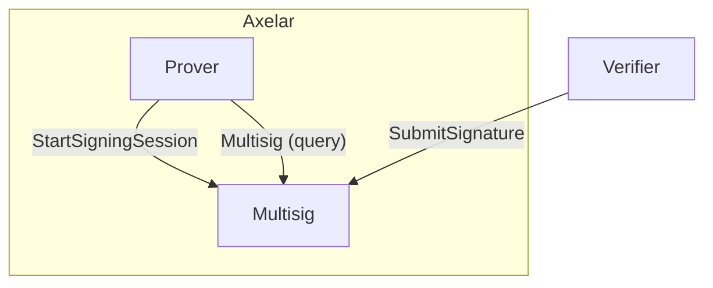
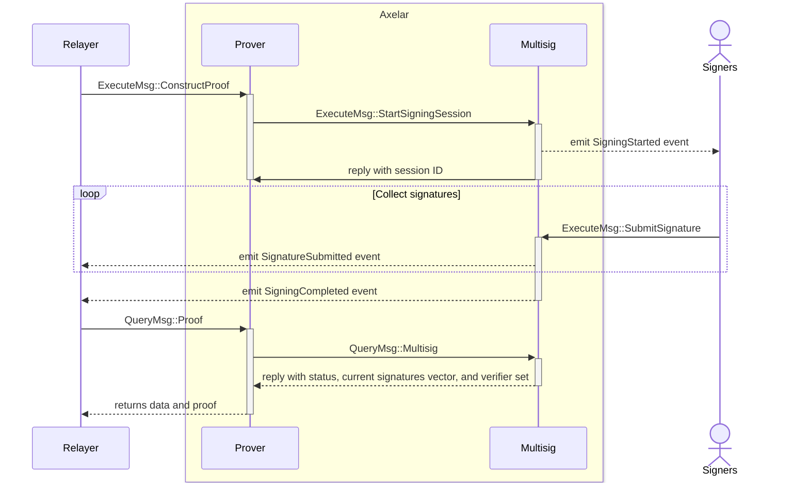
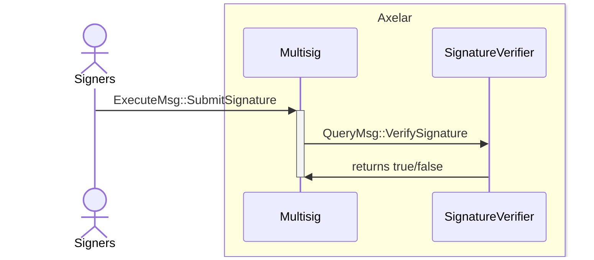

# Multisig contract

This contract is used by prover contracts during proof construction to start a signing session and collect signatures
from participants.



- **StartSigningSession**: The multisig contract receives a binary message from the prover. It uses the current active
  verifier set to back a new signing session and then emits an event to notify signers that a message is pending
  signature. The prover may optionally pass a `sig_verifier` address that overrides the default per-signature check.
- **SubmitSignature**: Each signer signs the message using their own private key and submits the signature. The
  contract validates that the signer is a participant in the verifier set associated with the session.
- **Multisig (query)**: The prover queries this to retrieve the current state of the session, the collected signatures
  so far, and the verifier set with participant information. The final proof is assembled by the prover once the
  multisig session is completed.

<br />

## Signing Sequence Diagram



## Custom signature verification

If the multisig contract does not natively support the required signature verification, the `sig_verifier` parameter
in `ExecuteMsg::StartSigningSession` can be set by the prover to specify a custom signature verification contract. The
custom contract must implement the following interface defined in `packages/signature-verifier-api`:

```Rust
pub enum QueryMsg {
    #[returns(bool)]
    VerifySignature {
        signature: HexBinary,
        message: HexBinary,
        public_key: HexBinary,
        signer_address: String,
        session_id: Uint64,
    },
}
```

When a custom verification contract is specified, on each `SubmitSignature` call the multisig contract will query the
custom contract's `VerifySignature` to validate the signature. The custom contract returns `true` if the signature is
valid or `false` otherwise.



## Authorization

Prior to calling `StartSigningSession`, the prover contract must be _authorized_. To authorize one or more contracts,
governance calls `AuthorizeCallers` with a map of contract address to chain name. Authorization can be revoked by
either governance or the contract admin via `UnauthorizeCallers`. Each authorization is scoped to a single chain name:
a contract authorized for chain `X` can only start signing sessions for chain `X`.

Governance or the admin can also globally pause and resume signing via `DisableSigning` / `EnableSigning`.

## Interface

```Rust
pub enum ExecuteMsg {
    // Open a new signing session. Permission: Specific(authorized) — only contracts that
    // were previously approved via AuthorizeCallers can call this.
    StartSigningSession {
        verifier_set_id: String,
        msg: HexBinary,
        chain_name: ChainName,
        // Optional address of a contract that overrides the default signature check.
        // See "Custom signature verification" above.
        sig_verifier: Option<String>,
    },

    // Submit a signature from a participant in the verifier set for the session.
    // Permission: Any (the verifier set check is part of execution).
    SubmitSignature {
        session_id: Uint64,
        signature: HexBinary,
    },

    // Register a new verifier set so future signing sessions can reference it by id.
    // Permission: Any (callable by provers as part of their rotation flow).
    RegisterVerifierSet { verifier_set: VerifierSet },

    // Register a public key for the sender. To prevent registering someone else's key, the
    // sender must sign their own address using the private key being registered.
    // Permission: Any.
    RegisterPublicKey {
        public_key: PublicKey,
        signed_sender_address: HexBinary,
    },

    // Authorize a set of contracts to call StartSigningSession. Each entry is scoped to a
    // specific chain name. Permission: Governance.
    AuthorizeCallers {
        contracts: HashMap<String, ChainName>,
    },

    // Revoke authorization for a set of contracts. Permission: Elevated (admin or governance).
    UnauthorizeCallers {
        contracts: HashMap<String, ChainName>,
    },

    // Emergency command to stop all signing. Permission: Elevated.
    DisableSigning,

    // Resumes signing after an emergency shutdown. Permission: Elevated.
    EnableSigning,
}

#[derive(QueryResponses)]
pub enum QueryMsg {
    // Returns the Multisig session state, collected signatures, and verifier set.
    #[returns(Multisig)]
    Multisig { session_id: Uint64 },

    // Returns a previously registered VerifierSet by its id.
    #[returns(VerifierSet)]
    VerifierSet { verifier_set_id: String },

    // Returns a registered public key for a verifier and key type.
    #[returns(PublicKey)]
    PublicKey {
        verifier_address: String,
        key_type: KeyType,
    },

    // Returns whether the given contract is currently authorized to start signing sessions
    // for the given chain.
    #[returns(bool)]
    IsCallerAuthorized {
        contract_address: String,
        chain_name: ChainName,
    },
}

pub struct Multisig {
    pub state: MultisigState,
    pub verifier_set: VerifierSet,
    pub signatures: HashMap<String, Signature>,
}

pub enum MultisigState {
    Pending,
    Completed { completed_at: u64 },
}
```

## Events

```Rust
pub enum Event {
    // Emitted when a new signing session is open.
    SigningStarted {
        session_id: Uint64,
        verifier_set_id: String,
        pub_keys: HashMap<String, PublicKey>,
        msg: MsgToSign,
        chain_name: ChainName,
        expires_at: u64,
    },
    // Emitted when a participant submits a signature.
    SignatureSubmitted {
        session_id: Uint64,
        participant: Addr,
        signature: Signature,
    },
    // Emitted when a signing session was completed.
    SigningCompleted {
        session_id: Uint64,
        completed_at: u64,
        chain_name: ChainName,
    },
    // Emitted when a PublicKey is registered.
    PublicKeyRegistered {
        verifier: Addr,
        public_key: PublicKey,
    },
    // Emitted when a contract is authorized to create signing sessions for a chain.
    CallerAuthorized {
        contract_address: Addr,
        chain_name: ChainName,
    },
    // Emitted when a contract is unauthorized.
    CallerUnauthorized {
        contract_address: Addr,
        chain_name: ChainName,
    },
    // Emitted when signing is globally enabled.
    SigningEnabled,
    // Emitted when signing is globally disabled.
    SigningDisabled,
}
```
